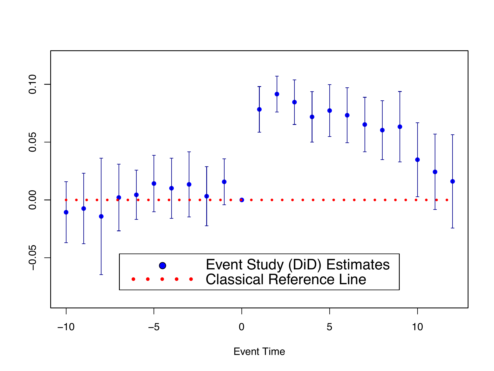
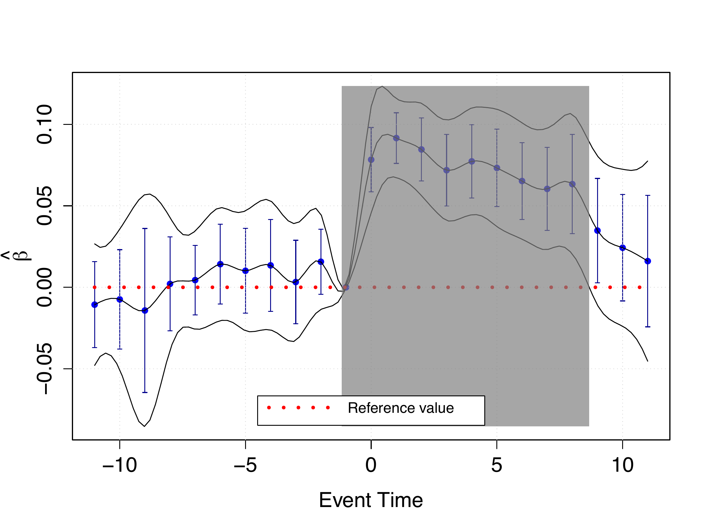
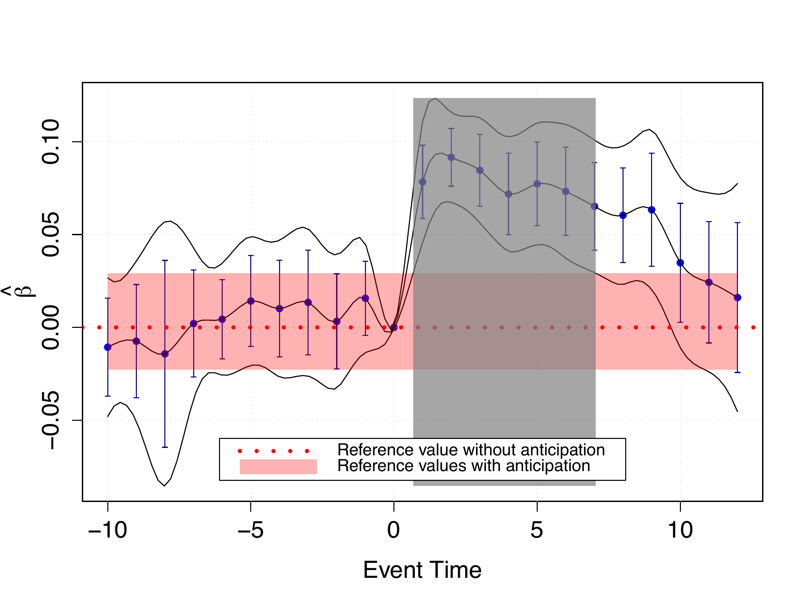
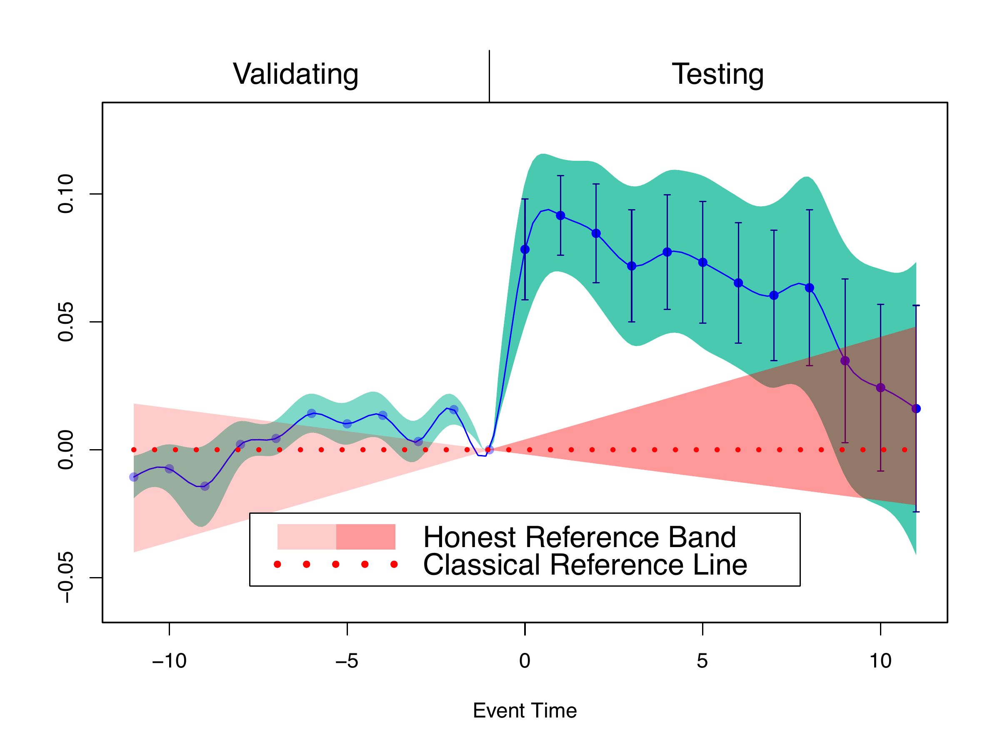

# fdid: Making Event Study Plots Honest 

[](https://makeapullrequest.com)


The R package `fdid` allows users to implement the method proposed in Fang and Liebl (2025)[^1]. In this paper, we present a novel functional perspective on Difference-in-Differences (DiD) that allows for honest inference using event study plots under violations of parallel trends and/or no-anticipation assumptions. Specifically, in our proposed plot, we compute an infimum-based simultaneous confidence band in the pre-treatment period by parametric bootstrap, and a supremum-based simultaneous confidence band in the post-treatment period by the algorithm of Kac-Rice formula proposed in Liebl and Reimherr (2023)[^2]. Additionally, by contrast to classical reference line in traditional event study plots, we derive an honest reference band based on the violation of parallel trends or no-anticipation assumption for making inference.

By doing so, we turn traditional event study plots into rigorous honest causal inference tools through equivalence and relevance testing: Honest reference band can be validated using equivalence testing in the pre-anticipation period, and honest causal effects can be tested using relevance testing in the post-treatment period.

> You may find a presentation of an early version of the paper in my YouTube [video](https://www.youtube.com/watch?v=h0KCv8y9Apw). Also, users can adjust their honest reference bands interactively via our [Shiny app](https://ccfang2.shinyapps.io/fdidHonestInference/).

## Installation

You can install the development version of `fdid` from [GitHub](https://github.com/) with:
      
``` r
# install.packages("devtools")
devtools::install_github("ccfang2/fdid")
```

## Classical Event Study Plot

We hereby use event study estimates from Gallagher (2014)[^3]. The following is the traditional event study plot displaying point-wise 95% confidence intervals with event time -1 as the reference time.

```r
library(fdid)
data(Gdata)
fdid_scb_est <- fdid_scb(beta=Gdata$beta, cov=Gdata$cov, t0=Gdata$t0)
EventStudyPlot_Classical(fdid_scb_est, pos.legend="bottom", scale.legend=1.4)
```

<p align="center">

</p>

> The function `fdid_scb()` is used to compute simultaneous confidence bands from using the estimates of event study coefficients, covariances and reference time point, which will be used in the honest causal inference. 

However, classical event study plots---such as the one above---suffer from at least three important limitations. 

 1. First, they typically display pointwise confidence intervals that do not account for multiple testing across event times.
 2. Second, they can create a misleading impression that significant effects persist over continuous intervals, even though the underlying theory addresses only the discrete time points. This impression is further amplified when applied studies connect pointwise event study estimates and confidence intervals with straight lines across event times.
 3. Third, and most importantly from a practical standpoint, honest inference methods—such as those developed by Rambachan and Roth (2023)[^4]—cannot be integrated into standard event study plots, limiting their usefulness for credible causal inference.

We address these limitations by introducing a functional-data perspective on DiD. The key idea is to model the underlying time-series processes in continuous time—an assumption already implicit in many event-study plots in
the empirical DiD literature—thereby embedding the DiD methodology within a coherent functional-data framework.

## Simultaneous Confidence Bands

We can therefore transform the traditional event study plot into a rigorous honest inference tool with the infimum-based 90% simultaneous confidence band in pre-treatment period and supremum-based 95% simultaneous confidence band in post-treatment period. The following is the new plot using simultaneous confidence bands.

``` r
plot(fdid_scb_est, pos.legend="bottom", scale.legend=1.4, note.pre=FALSE)
```

<p align="center">

</p>

We use the generic function `plot()` to derive the plot. In the post-treatment period, the supremum-based 95% simultaneous confidence band is wider than the classical 95% confidence intervals, because the point-wise intervals fail to take into account the multiple testing. The treatment effect is uniformly significant in the simultaneous causal inference using the classical reference line over event time [0, 8.7]. 

> We do not perform validation in the pre-treatment period, because we only use the classical reference line in the simultaneous inference above.

> If you do not have estimates of event study coefficients and covariances, you may use our function `fdid()` to estimate them from using your original data. Our function allows the estimation under both non-staggered and staggered DiD designs. In particularly, we consider the negative weighting problem of estimating event study coefficients under staggered designs and use carefully chosen non-negative weights to sum up estimates from different treatment subgroups.

To conduct honest inference using the plot above, we need to derive the honest reference band under violations of identification assumptions. Below are two examples of deriving honest reference band under the violation of no-anticipation and parallel trends assumption respectively.

## Example 1: Honest Reference Band under Violation of No-anticipation Assumption

We now suppose that, after event time -3, there is an anticipation of treatment. We use control parameters $S_{u}=1.55$ and $S_{\ell}=2.55$ to derive the reference band (see equation (36) in Fang and Liebl (2025)[^1] for details on the control parameters).

``` r
plot(fdid_scb_est, ta.ts=-3, ta.s=c(1.55,2.55), pos.legend="bottom", scale.legend=1.4, ci.post=TRUE, ref.band.pre = TRUE)
```

<p align="center">

</p>

With an anticipation after event time -3, one may see that the treatment effect is still uniformly significant over event time [0, 7.8]. With the given control parameters, the reference band can be validated at the significance level 5%, since the infimum-based 90% simultaneous confidence band strictly lies within the reference band in the pre-anticipation period (see Section 3.3 in Fang and Liebl (2025)[^1] for details). The result shows that the treatment effect in Gallagher(2014)[^3] is robust under the considered treatment anticipation.

## Example 2: Honest Reference Band under Violation of Parallel Trends Assumption

We now suppose that, there is differential trend. We use control parameters $M_{u}=0.3$ and $M_{\ell}=0.3$ to derive the reference band (see equation (37) in Fang and Liebl (2025)[^1] for details on the control parameters).

``` r
plot(fdid_scb_est, frmtr.m=c(0.3,0.3), pos.legend="bottom", scale.legend=1.4, ci.post=TRUE, ref.band.pre = TRUE)
```

<p align="center">

</p>

In the plot above, although the reference band cannot be validated at the significance level 5% due to high data variability, it captures the visible upward pre-trend with a width comparable to that of the infimum-based band, providing substantive justification. Using this reference band, we find that the treatment effect is still uniformly significant over event time [0, 6.3]. The result shows that the treatment effect in Gallagher(2014)[^3] is robust under the considered violation of parallel trends assumption.

> In some cases, validating a given reference band can be challenging, as doing so may require selecting a very wide reference band—thereby making subsequent testing in the post-treatment period overly conservative. Such non-rejection of the equivalence null hypothesis (see Section 3.3 in Fang and Liebl (2025)[^1]) often reflects limited sample size or high variability, and must be viewed as a lack of evidence against the null, not confirmation of it. Thus, a reference band failing to pass the validation can still be used for honest inference when its specification can be supported by domain-specific justification.

## Contact
Chencheng Fang, Email: [ccfang[at]uni-bonn.de](mailto:ccfang@uni-bonn.de), Hausdorff Center for Mathematics; Institute of Finance and Statistics, University of Bonn


[^1]: Fang, C. and Liebl, D. (2025). Making Event Study Plots Honest: A Functional Data Approach to Causal Inference. [arXiv:2512.06804](https://arxiv.org/abs/2512.06804).
[^2]: Liebl, D. and M. Reimherr (2023). Fast and fair simultaneous confidence bands for functional parameters. Journal of the Royal Statistical Society Series B: Statistical Methodology 85(3), 842–868.
[^3]: Gallagher, J. (2014). Learning about an Infrequent Event: Evidence from Flood Insurance Take-Up in the United States. American Economic Journal: Applied Economics 6(3), 206–33.
[^4]: Rambachan, A. and J. Roth (2023). A more credible approach to parallel trends. The Review
of Economic Studies 90 (5), 2555–2591.
