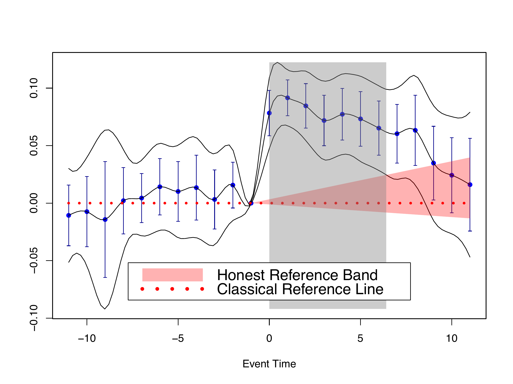

# fdid 

[](https://makeapullrequest.com)


> The R package `fdid` allows users to implement the method proposed in Fang and Liebl (2025)[^1]. In this paper, we present a novel functional perspective on Difference-in-Differences (DiD) that allows for honest inference using event study plots under violations of parallel trends and/or no-anticipation assumptions. We use the algorithm of so-called fast and fair simultaneous confidence band from Liebl and Reimherr (2023)[^2] to construct the simultaneous confidence band in our plots.

> We turn traditional event study plots into rigorous honest causal inference tools through equivalence and relevance testing: Honest reference bands can be validated using equivalence testing in the pre-treatment period, and honest causal effects can be tested using relevance testing in the post-treatment period.

> You may find a presentation of an early version of the paper in my YouTube [video](https://www.youtube.com/watch?v=h0KCv8y9Apw). Also, users can adjust their honest reference bands (see below) interactively via our [Shiny app](https://ccfang2.shinyapps.io/fdidHonestInference/).

## Installation

You can install the development version of `fdid` from [GitHub](https://github.com/) with:
      
``` r
# install.packages("devtools")
devtools::install_github("ccfang2/fdid")
```

## Example 1: Classical Simultaneous Causal Inference

We hereby use event study estimates from Gallagher (2014)[^3] as an example. 

``` r
library(fdid)
data(Gdata)
fdid_scb_est <- fdid_scb(beta=Gdata$beta, cov=Gdata$cov, t0=Gdata$t0)
plot(fdid_scb_est, pos.legend="bottom", scale.legend=1.4)
```

We first load the data from our package, and then we use the function `fdid_scb()` to compute simultaneous confidence band from using the estimates of event study coefficients, covariances and reference time point, and finally we use the generic function `plot()` to derive a figure as follows.

<p align="center">

</p>

As is seen, the reference time in this example is at event time -1. The gray area indicates the time span over which the treatment effect is uniformly significant under our simultaneous confidence band. Traditional confidence intervals are also plotted. The intervals fail to take into account the multiple testing problem, so they are typically narrower than our band. 

If you do not have estimates of event study coefficients and covariances, you may use our function `fdid()` to estimate them from using your original data. Our function allows the estimation under both non-staggered and staggered DiD designs. In particularly, we consider the negative weighting problem of estimating event study coefficients under staggered designs and use carefully chosen non-negative weights to sum up estimates from different treatment subgroups.

## Example 2: Honest Causal Inference under Treatment Anticipation with Reference Band

Following Example 1, we now suppose that, after event time $t_A=-1$, there is an anticipation of treatment. We use $t_S=-9 < t_A$ to compute the sample estimates for the reference band.

``` r
plot(fdid_scb_est, ta.ts=-9, ta.s=2.6, pos.legend="bottom", scale.legend=1.4)
```

<p align="center">

</p>

With an anticipation after event time -1, one may see the time span over which the treatment effect is uniformly significant shrinks. With the control parameter $S=2.6$, the reference band can be validated at significance level 5\%, since the simultaneous confidence band strictly lies within the reference band in the pre-treatment period.

## Example 3: Honest Causal Inference under Differential Trends with Relative Magnitudes Reference Band

Following Example 1, we now suppose that, there is differential trend of relative magnitudes with control parameter $\overline{M}=1$.

``` r
plot(fdid_scb_est, frm.mbar=1, pos.legend="bottom", scale.legend=1.4)
```

<p align="center">

</p>

Under such a differential trend, the time span over which the treatment effect is uniformly significant is also smaller. It can be seen that the average absolute derivative of functional DiD estimate over pre-treatment time is quite large, so our reference band for honest inference is also wide.

## Example 4: Honest Inference under Differential Trends with Trend Restrictions Reference Band

Following Example 1, we now suppose that, there is differential trend of trend restrictions with control parameter $M=2$.

``` r
plot(fdid_scb_est, ftr.m=2, pos.legend="bottom", scale.legend=1.4)
```

<p align="center">

</p>

With this specific differential trend, the time span over which the treatment effect is uniformly significant is not so different from that without. It can be seen that the pre-trend, measured by the average of derivative of functional DiD estimate over pre-treatment time, is quite small. Hence, the inference result does not change too much from Example 1, even though the control parameter is not infinitesimal.

## Contact
Chencheng Fang, Email: [ccfang[at]uni-bonn.de](mailto:ccfang@uni-bonn.de), Institute of Finance and Statistics, University of Bonn

## Reference
[^1]: Fang, C. and Liebl, D. (2025). Making Event Study Plots Honest: A Functional Data Approach to Causal Inference. Working Paper
[^2]: Liebl, D. and M. Reimherr (2023). Fast and fair simultaneous confidence bands for functional parameters. Journal of the Royal Statistical Society Series B: Statistical Methodology 85(3), 842–868
[^3]: Gallagher, J. (2014). Learning about an Infrequent Event: Evidence from Flood Insurance Take-Up in the United States. American Economic Journal: Applied Economics 6(3), 206–33.
